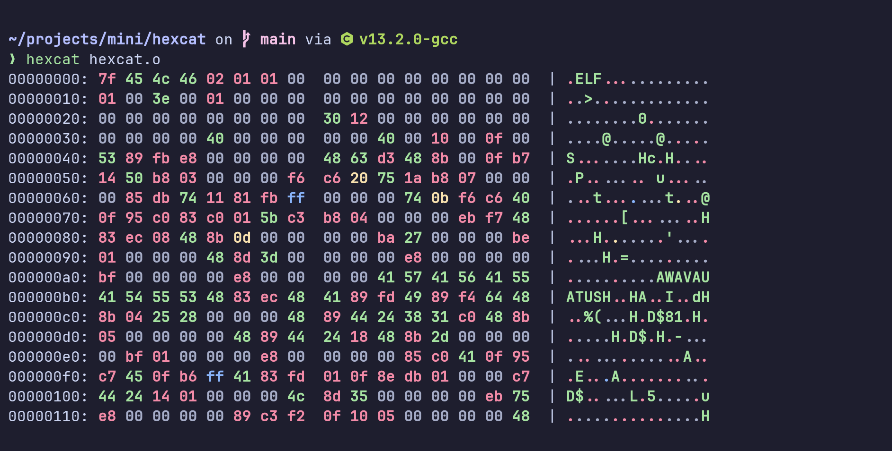

# hexcat

An extremely small hexdump tool.

## Screenshots

[](assets/demo.png)

## Usage

You can build `hexcat` with cargo:

```bash
$ cargo install --git https://codeberg.org/Kaamkiya/hexcat
```

Help:

```bash
$ hexcat -h
```

If you don't specify a file to read from, hexcat will read from stdin, so you
can also pipe to it:

```bash
$ cat some-file | hexcat
```

It will write the data to stdout, or you can specify a file using redirection:

```bash
$ echo "Let's go fly a kite" | hexcat > hello.txt
```

Try `hexcat -h` for all available flags.

## License

This project is licensed under the MIT license.
